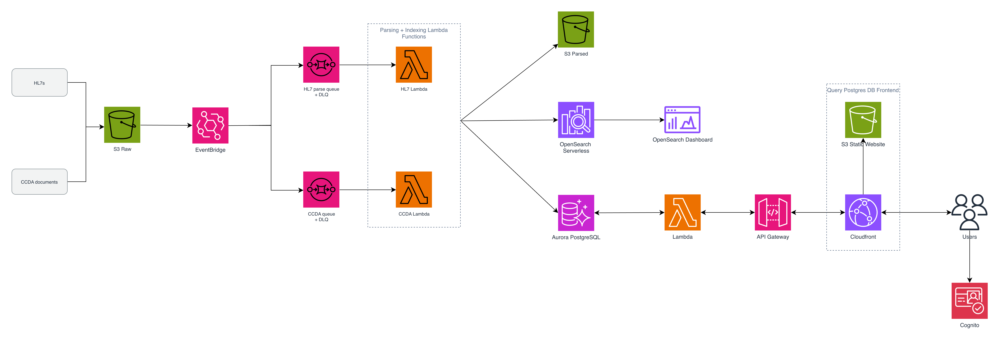

# Manifest MedEx Data Quality Platform

A private, serverless AWS ingestion platform for parsing, indexing, and tracking HL7 v2 messages and CCDA documents.

| Section | Description |
| --- | --- |
| [Overview](#overview) | Purpose, scope, and current limitations |
| [Architecture](#architecture) | Format-specific ingestion paths and durable destinations |
| [Description](#description) | Technology, repository structure, parsing, and security |
| [Deployment](#deployment) | Prerequisites, configuration, validation, synthesis, and deployment |
| [Usage](#usage) | Input conventions, outputs, and post-deployment checks |
| [Development tools](#development-tools) | HL7 dictionary generation and query-parity validation |
| [Operations and troubleshooting](#operations-and-troubleshooting) | Retries, alarms, costs, and common failures |
| [Data and security rules](#data-and-security-rules) | Requirements for clinical and identifying data |
| [Support](#support) | How to report issues safely |
| [License](#license) | Current licensing status |
| [Disclaimers](#disclaimers) | Evaluation and production-use caveats |

# Overview

Manifest MedEx Data Quality Platform is an AWS CDK application that creates separate HL7 v2 and CCDA ingestion lanes plus an authenticated, same-origin clinical-message explorer. New objects in a private, versioned Amazon S3 raw-data bucket are routed through Amazon EventBridge and format-specific Amazon SQS queues to two ingestion AWS Lambda functions. Each function parses its input, writes deterministic JSON to parsed S3, indexes a query-oriented projection in Amazon OpenSearch Serverless, and upserts document-location metadata through the Amazon Aurora PostgreSQL Data API. A third isolated Lambda serves Cognito-authorized metadata and bounded body reads to a React frontend hosted in private S3 behind CloudFront Origin Access Control.

The design keeps the raw object as the complete source of truth while exposing a deliberately bounded search projection for supplied dashboard requirements. It emphasizes private networking, encryption, least-privilege access, deterministic retries, retained storage, and diagnostics that do not reveal clinical content or identifiers.

This repository is an implementation prototype. It does not establish HL7 profile conformance, CCDA template conformance, customer-data parity, production capacity, or regulatory compliance. Validate those concerns independently before handling production or regulated data.

# Architecture Diagram



# Description

## Technology stack

| Category | Technology | Purpose |
| --- | --- | --- |
| Infrastructure | [AWS CDK v2](https://docs.aws.amazon.com/cdk/v2/guide/home.html), Python | Defines and synthesizes the complete platform |
| Object storage | [Amazon S3](https://aws.amazon.com/s3/) | Versioned raw, parsed, error, and access-log storage |
| Routing | [Amazon EventBridge](https://aws.amazon.com/eventbridge/) | Routes new objects by format prefix |
| Buffering | [Amazon SQS](https://aws.amazon.com/sqs/) | Isolated processing queues and dead-letter queues |
| Compute | [AWS Lambda](https://aws.amazon.com/lambda/) | Python 3.14 ARM64 ingestion and authenticated explorer API |
| Web and API | React, Vite, TypeScript, CloudFront, HTTP API | Same-origin clinical-message explorer and API proxy |
| Identity | Amazon Cognito | Hosted UI Authorization Code with PKCE and JWT route authorization |
| Search | [Amazon OpenSearch Serverless](https://aws.amazon.com/opensearch-service/features/serverless/) | Query-oriented HL7 and CCDA indexes |
| Metadata | [Amazon Aurora PostgreSQL](https://aws.amazon.com/rds/aurora/) 16.8 | Document-location metadata through the Data API |
| Security | AWS KMS, IAM, VPC endpoints | Encryption, least privilege, and private service access |
| Monitoring | Amazon CloudWatch | Encrypted logs, queue-age alarms, DLQ alarms, and Lambda-error alarms |
| Parsing | `hl7==0.4.5`, `defusedxml==0.7.1` | Lenient HL7 parsing and hardened XML parsing |
| Development | `uv`, Ruff, mypy, pytest, cdk-nag | Reproducible dependencies and automated validation |

Runtime dependencies are hash-pinned in `lambda-requirements.txt`. CDK dependencies and development tools are exactly pinned in `pyproject.toml` and `uv.lock`.

## Project structure

```text
.
├── app.py                         # CDK application entry point and cdk-nag registration
├── cdk.json                       # Default CDK context
├── lambda-requirements.txt        # Hash-pinned Lambda dependencies
├── Makefile                       # Installation, validation, and HL7 tool targets
├── pyproject.toml                 # Project, test, lint, and type-check configuration
├── src/
│   ├── config.py                  # Validated deployment context and safety constraints
│   ├── stack.py                   # AWS infrastructure and Lambda asset bundling
│   ├── parser.py                  # HL7 splitting, parsing, identity, and ROOT projection
│   ├── ccda_parser.py             # Secure CCDA parsing and CD projection
│   ├── customer_field_catalog.py  # Customer-backed HL7 names and CCDA section aliases
│   ├── document_handler.py        # Shared S3, parse, search, and metadata workflow
│   ├── hl7_handler.py             # HL7 Lambda entry point
│   ├── ccda_handler.py            # CCDA Lambda entry point
│   ├── explorer_handler.py        # Authenticated list, detail, and bounded body API
│   ├── search_store.py            # OpenSearch mappings, bulk writes, and SigV4 transport
│   └── metadata_store.py          # Aurora schema, indexes, and Data API upserts
├── web/                           # React/Vite/TypeScript authenticated explorer
│   ├── src/                       # OIDC, API client, query, and UI source
│   ├── public/config.json         # Non-secret local runtime-config placeholder
│   ├── package.json               # Exact frontend dependency pins
│   └── package-lock.json          # Reproducible npm dependency graph
├── tests/                         # Unit, integration-style, CDK, and cdk-nag tests
└── tools/
    ├── generate_hl7_dictionary.py # Development-only HL7 v2.6 label generator
    ├── probe_hl7_versions.py      # Cross-version datatype comparison
    └── validate_against_customer_queries.py
                                      # Delivered query-path parity check
```

The Lambda artifact contains the runtime `src` modules and exact runtime dependencies. Tests, tools, caches, all of `web/`, `src/stack.py`, and `src/config.py` are excluded from both local and Docker fallback bundles.

## HL7 v2 processing

The HL7 parser supports:

- UTF-8 files with CR, LF, or CRLF segment separators.
- Optional MLLP framing.
- Multiple concatenated messages split at `MSH` segments.
- Delimiters declared dynamically in `MSH`.
- Standard safe escape decoding.
- Message-type metadata extraction, including ADT, MDM, ORU, RDE, and VXU.
- Unknown and locally defined segments.
- Whole-object provenance checksums and deterministic per-message content IDs.
- HL7 timestamp normalization; timestamps without offsets are interpreted as UTC.
- A 50 MiB raw-object limit.

The indexed `ROOT` projection is driven by the committed customer field catalog. It contains 621 unambiguous, standards-backed HL7 v2.6 fields across 30 segment families whose exact output labels occur in the August 24 Kibana export. Composite datatype and subcomponent names are projected recursively, and repetitions remain arrays. Elasticsearch metadata, Prism enrichment keys, derived `_text`/`_resolution`/`_string` fields, and numeric nodes beyond valid segment ranges are intentionally excluded. `segmentCounts` still records every observed segment type; locally defined segments remain counted but are not fabricated into the customer projection.

Parser output identifies the implementation as version `0.5.0`. HL7 document IDs are `SHA-256(bucket + key + SHA-256(normalized message))`; exact duplicate messages under one S3 key collapse to the first occurrence and retain its `messageOrdinal`. S3 version IDs and ETags remain provenance metadata but do not affect HL7 identity.

## CCDA processing

CCDA XML is parsed with `defusedxml`. The parser rejects DTDs, entities, external references, excessive markup, unsafe nesting depth, malformed XML, and roots other than `ClinicalDocument`.

The indexed `CD` projection covers structured fields used by supplied dashboard queries for patient role, custodian, medications, immunizations, problems, procedures, results, vital signs, and social history. Seven canonical sections are resolved by their standard LOINC codes. Other structured sections can be resolved by title or code display name through 108 normalized concepts representing all 116 exact section aliases observed in the August 24 Kibana export. Recognized sections generically project supported `substanceAdministration`, `organizer`, `act`, `observation`, and `procedure` entries. Narrative section bodies remain intentionally excluded.

CCDA parser output identifies the implementation as version `0.3.0`. CCDA document IDs are `SHA-256(bucket + key + SHA-256(exact raw XML bytes))`. Identical XML bytes under one S3 key resolve to the same logical document across source versions; byte-level formatting changes create a new ID. S3 version IDs and ETags remain provenance metadata but do not affect CCDA identity.

## Metadata contract

Aurora stores document identity, source format, normalized document time, ingestion time, and durable S3 locations:

```sql
CREATE TABLE IF NOT EXISTS document_metadata (
    document_id        TEXT PRIMARY KEY,
    source_format      TEXT NOT NULL
                       CHECK (source_format IN ('hl7-v2', 'ccda')),
    document_time      TIMESTAMPTZ,
    ingested_time      TIMESTAMPTZ NOT NULL,
    raw_s3_uri         TEXT NOT NULL,
    raw_version_id     TEXT,
    parsed_s3_uri      TEXT NOT NULL,
    parsed_version_id  TEXT
);
```

`document_time` comes from HL7 MSH-7 or CCDA `effectiveTime`; `ingested_time` comes from the S3 EventBridge event. Stored locations are `s3://bucket/key` references rather than expiring presigned URLs.

Newest-first explorer reads use keyset pagination over `(ingested_time, document_id)` with no `OFFSET`. Each list request also runs an exact `COUNT(*)` over the active ingestion-time/source-format filters so the UI can display the total result count and total pages. Exact counts can add latency on very large ranges even with the indexes below. `_ensure_schema()` creates these idempotent indexes for a new or empty table:

```sql
CREATE INDEX IF NOT EXISTS document_metadata_ingested_document_idx
ON document_metadata (ingested_time DESC, document_id DESC);

CREATE INDEX IF NOT EXISTS document_metadata_format_ingested_document_idx
ON document_metadata (source_format, ingested_time DESC, document_id DESC);
```

For an existing production table, normal `CREATE INDEX` can block writes. Run the equivalent `CREATE INDEX CONCURRENTLY IF NOT EXISTS` statements as a separately reviewed, one-off maintenance operation instead. `CONCURRENTLY` is intentionally absent from Lambda initialization because PostgreSQL does not permit it inside the Data API's implicit transaction.

## Infrastructure and security

The stack creates:

- One rotating customer-managed KMS key.
- Private, versioned raw, parsed, and error S3 buckets with KMS encryption and retained deletion policies.
- A private, versioned frontend S3 bucket served only through CloudFront Origin Access Control.
- A separate access-log bucket.
- Separate KMS-encrypted HL7 and CCDA queues, each with a 14-day DLQ and a maximum receive count of five.
- Two Python 3.14 ARM64 ingestion Lambda functions with 2 GiB memory, 10-minute timeouts, encrypted 30-day logs, and bounded concurrency.
- One Python 3.14 ARM64 explorer Lambda in isolated subnets with read-only object access, Data API `ExecuteStatement`, and 4 MiB response caps.
- Cognito Hosted UI, one public PKCE app client, and a Cognito-authorized HTTP API with no default stage.
- One CloudFront distribution using private S3 OAC for static assets and an uncached `/api/*` behavior for HTTP API.
- An isolated, no-NAT VPC with rejected-traffic flow logs.
- An S3 gateway endpoint plus private OpenSearch Serverless and RDS Data API interface endpoints.
- One private Aurora PostgreSQL 16.8 Serverless v2 writer with 0.5–2 ACU, Data API, IAM database authentication, KMS encryption, and retained storage.
- One private OpenSearch Serverless `SEARCH` collection with `hl7-messages-v1` and `ccda-documents-v1`.
- Queue-age, dead-letter-queue, and Lambda-error alarms for both formats.

There is no public Aurora instance, RDS Proxy, reader instance, NAT gateway, direct Lambda PostgreSQL connection, or port 5432 ingress rule.

Production enables stack termination protection, Aurora deletion protection, 35-day Aurora backups, and OpenSearch standby replicas. Non-production uses seven-day Aurora backups. Stored data and the OpenSearch collection remain retained when the stack is deleted; plan an explicitly approved retention or disposal process.

## Authenticated message explorer

The stack also provides a same-origin, authenticated browser explorer:

```text
CloudFront
├── default behavior → private frontend S3 bucket through Origin Access Control
└── /api/*           → HTTP API api stage → explorer Lambda in isolated subnets
                                             ├── RDS Data API endpoint
                                             └── S3 gateway endpoint
```

The React/Vite/TypeScript source is under `web/`. Dependencies use exact versions in `package.json` and a committed npm lockfile. CDK deploys `web/dist` to a private S3 bucket and writes a non-secret runtime `config.json`. CloudFront disables API caching, forwards the bearer token and query values while replacing the origin `Host`, and applies HSTS, `nosniff`, and frame-deny headers. CloudFront request logging and API stage access logging are intentionally disabled because the required routes contain document IDs; the body-read Lambda emits the narrower audit event described below.

Cognito Hosted UI authentication is mandatory. Self-signup is disabled, the password minimum is 14 characters with complexity requirements, software TOTP MFA is available, and the public app client uses Authorization Code with PKCE. Every route uses the same Cognito JWT authorizer; there is no unauthenticated demo route or API default stage. The frontend keeps tokens in memory and stores only transient OIDC state and the PKCE verifier in tab-scoped `sessionStorage` so the Hosted UI redirect can complete.

The API contract is:

- `GET /api/messages?from&to&source_format&limit&cursor` — newest-first metadata with exact `totalCount`; `from` is an inclusive `ingested_time` lower bound and `to` is an exclusive `ingested_time` upper bound, matching Entity Explorer's `createdTime >=` / `<` range behavior; default 50, maximum 200, opaque forward cursor. The UI derives result ranges and total pages from the exact count and exposes numbered controls for sequentially discovered keyset pages without using `OFFSET`.
- `GET /api/messages/{documentId}` — one metadata record and its durable storage references.
- `POST /api/messages/{documentId}/body` with `{ "variant": "raw" | "parsed" }` — direct content with the appropriate text, XML, or JSON content type.
- `POST /api/query` with `{ "sql": "..." }` — execute one unrestricted SQL statement and return generic columns, rows, and the affected-record count. SQL text is limited to 100,000 characters and the serialized result to 4 MiB.

The UI provides Messages and SQL query views. SQL queries can be named, saved, loaded, and deleted using browser `localStorage`; they are not synchronized between browsers or users. A visible loading spinner is shown while SQL executes. SQL result rows containing a valid `document_id`, `documentId`, or `_id` open the same authenticated detail pane and audited Raw/Parsed body endpoints as the Messages view.

Body content is fetched server-side from the exact stored S3 version and is never exposed through a presigned URL. Synchronous bodies are capped at 4 MiB and read through a bounded stream to remain below Lambda/API response limits. A successful body read writes a structured audit event containing the authenticated JWT `sub`, document ID, variant, and timestamp, but never the body, clinical fields, S3 key, SQL, or raw backend response. Successful SQL execution emits the caller `sub`, timestamp, row count, and affected-record count without logging the SQL text or returned values.

This prototype provides authentication but not row-, facility-, or tenant-level authorization: every authenticated user in the pool can read every metadata row and body. The SQL console is deliberately unrestricted and uses the generated Aurora administrative credential, so any authenticated user can execute modifying or destructive SQL against the database, including changing or dropping metadata objects. IAM grants only `rds-data:ExecuteStatement`, but that action does not make SQL read-only. Before production, federate the user pool to the customer identity provider through approved SAML or OIDC configuration, add an authorization policy/data model, and replace the administrative credential with a database role whose grants match the intended console permissions.

## Parsed-zone reingestion

The SQL tab can restore historical documents from the durable parsed S3 zone into the OpenSearch hot window without reparsing raw input. This preserves the parsed JSON exactly, including its original `ingestTime`, and uses the stored `documentId` as the OpenSearch `_id`. Parser-version routing or upgrades are deliberately deferred; a document produced by an older parser is restored unchanged and counted as stale.

A reingestion can select documents in two ways:

- Check rows from the current SQL result and choose **Reingest selected**. At most 10,000 explicit document IDs are accepted.
- Choose **Reingest all results**. The backend previews an exact distinct-document count, shows a confirmation, and reruns the selection asynchronously. SQL selections are capped at 100,000 documents.

A reingestion SQL statement must be a single SELECT-only statement, contain a `document_id` projection, and contain no comments, additional statements, DML, DDL, `COPY`, procedure calls, or row locks. One trailing semicolon is accepted and removed only for safe derived-table execution; the submitted text remains verbatim in the authenticated job record. This guard is intentionally separate from the general `/query` endpoint, which remains unrestricted. The planner joins the selection to the validated `document_metadata` table and pages by `document_id > :cursor` with no `OFFSET` added by the planner.

The API creates a job in the KMS-encrypted reingestion DynamoDB table and asynchronously invokes a dedicated planner Lambda. The planner runs in isolated subnets, resolves `parsed_s3_uri` and `source_format` through the private RDS Data API endpoint, and sends bounded batches of ten to the KMS-encrypted reindex SQS queue. A small delay between batches limits queue fan-out. The queue has its own DLQ, age alarm, and DLQ-content alarm.

The DB-free reindexer Lambda runs in isolated subnets with reserved concurrency 5 and SQS partial-batch failure reporting. It reads only the parsed bucket, validates the stored JSON identity/format, and calls the existing deterministic `index_documents` path. It does not import either parser or forward data to ingestion queues. Current parser versions are injected into its environment at synth time only to classify stale stored parses.

Jobs expose these atomic counters:

- `enqueued`: accepted SQS messages.
- `reindexed`: parsed documents restored successfully.
- `reindexedStaleParser`: successful restores whose stored `parserVersion` differs from the current format parser; this is a subset of `reindexed`.
- `missingParsed`: metadata referenced a parsed object that no longer exists; skipped without a DLQ failure.
- `failed`: records that reached the terminal retry attempt.

The SQL tab polls the jobs list and shows status, requester, expected count, all five counters, timestamps, and expandable SQL for SQL-mode jobs. Job creation logs only the caller, mode, count, SQL SHA-256, job ID, and timestamp. Message content, selected IDs, SQL results, and clinical values are never logged.

The reindex queue has at-least-once delivery semantics. Restoring a duplicate is safe because OpenSearch uses the deterministic `documentId`, but in the rare case of a true duplicate delivery the advisory counters can overcount and may mark a job complete before another queued record finishes. The 15-minute queue visibility timeout exceeds the 5-minute worker timeout, reducing normal redelivery; exact per-message completion would require a separate idempotency ledger and is deferred for this development workflow.

Authenticated routes are:

- `POST /api/reingest/preview`
- `POST|GET /api/reingest/jobs`
- `GET /api/reingest/jobs/{jobId}`

## Reports

The authenticated **Reports** tab reproduces the fixed-definition Prism workflow without adding a scheduler or query builder. A report fixes its ordered sections and count-query rows; a run selects only the report, an inclusive `from`, an exclusive `to`, and 1–200 facilities returned by `/facilities`.

### Row-granular definition storage

Definitions are stored in one KMS-encrypted DynamoDB table using meaningful composite keys:

```text
PK = REPORT#<report-id>
SK = META
SK = SECTION#<storage-seq:03d>
SK = SECTION#<storage-seq:03d>#ROW#<storage-seq:03d>
```

Storage sequences use gaps (`010`, `020`, …) so rows and sections can be inserted between existing items without renumbering. The JSON `seq` remains a separate compatibility value, allowing the canonical `seed/p4p-prototype.json` import/export shape to round-trip unchanged. A full definition is assembled with one DynamoDB Query in SK order. Row updates and deletes condition on `updated_at`; stale editors receive HTTP 409.

Whole-definition import validates `schema/report_definition.schema.json`, writes a hidden `draft=true` META item, batch-writes sections/rows in groups of at most 25, and flips the draft visible only after every item succeeds. A failed import is never listed as a partial report. Export reassembles the clean interchange JSON. Every non-null row query is also validated independently and cannot contain `sourceFacilityId` or `messageTime` clauses.

### Definition and query example

A report definition fixes its sections, rows, target indexes, and OpenSearch query clauses. Users do not edit facility or date filters inside the definition; those filters are injected for each run.

```json
{
  "report_id": "example-adt-report",
  "name": "Example ADT Report",
  "description": "Counts selected A08 fields",
  "partition_field": "sourceFacilityId",
  "time_field": "messageTime",
  "sections": [
    {
      "seq": 10,
      "name": "ADT A08",
      "rows": [
        {
          "seq": 10,
          "label": "PID-3.1",
          "description": "A08 messages containing a patient identifier",
          "index": "hl7-messages-v1",
          "query": {
            "bool": {
              "filter": [
                {
                  "term": {
                    "ROOT.MSH.MSH_9_Message_Type.MSG_1": "ADT"
                  }
                },
                {
                  "term": {
                    "ROOT.MSH.MSH_9_Message_Type.MSG_2": "A08"
                  }
                },
                {
                  "exists": {
                    "field": "ROOT.PID.PID_3_Patient_Identifier_List.CX_1"
                  }
                }
              ]
            }
          }
        },
        {
          "seq": 20,
          "label": "PID-11",
          "description": "Placeholder until the customer supplies its Prism logic",
          "index": "hl7-messages-v1",
          "query": null
        }
      ]
    }
  ]
}
```

An implemented row stores only the query clause under `query`; it does not store `size`, `track_total_hits`, facility, or date constraints. A placeholder row uses `"query": null`: its label remains in the grid and CSV, its count cell is blank, and the runner does not send it to OpenSearch. A real query that executes and finds no documents produces `0`, which is distinct from a placeholder blank.

For a run scoped to facility `FACILITY-A` and August 2026, the runner turns the implemented row above into an effective request equivalent to:

```json
{
  "size": 0,
  "track_total_hits": true,
  "query": {
    "bool": {
      "filter": [
        {
          "term": {
            "ROOT.MSH.MSH_9_Message_Type.MSG_1": "ADT"
          }
        },
        {
          "term": {
            "ROOT.MSH.MSH_9_Message_Type.MSG_2": "A08"
          }
        },
        {
          "exists": {
            "field": "ROOT.PID.PID_3_Patient_Identifier_List.CX_1"
          }
        },
        {
          "term": {
            "sourceFacilityId": "FACILITY-A"
          }
        },
        {
          "range": {
            "messageTime": {
              "gte": "2026-08-01T00:00:00Z",
              "lt": "2026-09-01T00:00:00Z"
            }
          }
        }
      ]
    }
  }
}
```

The checked-in schema is `schema/report_definition.schema.json`. Larger working examples are available in `seed/p4p-prototype.json` and `seed/p4p-demo.json`.

Every application-level definition mutation writes its audit record in the same DynamoDB `TransactWriteItems` call as the row/section/META change. Row audit sort keys are `AUDIT#SECTION#<sseq>#ROW#<rseq>#<timestamp>` and include action, editor, timestamp, and the full prior item for updates/deletes. Import writes one `action=import` audit item with its source rather than one item per imported row. `GET /api/reports/{id}/history?limit=50` reads audit items newest-first. Audit items are ignored during definition assembly and cannot alter export JSON. Direct DynamoDB console or table API writes bypass this application-level audit; this limitation is accepted for the POC because the explorer API and seed/migration tool are the only supported writers.

### Spreadsheet editor and dry-run queries

The Reports grid renders sections side by side as Label/Count column pairs, with each section heading spanning its own pair. Counts come from the newest completed run and are summed across that run's selected facilities; cells remain blank before a run, placeholders show no query, and a real zero renders as `0`. Selecting a row opens an editor for label, description, index, and query JSON with optimistic Save/Delete actions. The report detail also offers **Edit full report JSON**, protected by the report META `updated_at` lock, and **Delete report**, which requires typing the exact report ID and permanently removes the definition while preserving a deletion audit under `AUDITLOG#deleted-reports`. **Test query** uses the same injection/count implementation as the async runner, with an optional facility selected from the directory and an optional paired date range. A zero result is called out as `0 matches — check field names`.

The API supports report import/export, gapped section/row insertion, conditional row update/delete, and `/query-test`; all routes use the same Cognito JWT authorizer.

### Runner and CSV compatibility contract

The dedicated 15-minute runner Lambda remains in isolated subnets. For each facility it injects a `sourceFacilityId` term and half-open `messageTime` range (`gte`/`lt`), uses `size: 0`, `track_total_hits: true`, and `_msearch` batches of at most 20 rows. Progress is persisted per facility. Any partition failure marks the run failed and uploads no partial ZIP.

A run accepts 1–200 facilities. The cap is 200 rather than unlimited because the runner is intentionally a single sequential worker: it walks facilities one at a time inside one 15-minute Lambda, accumulates one CSV per facility, and packages them into one bounded in-memory ZIP delivered through a single API request. 200 is the largest fan-out that keeps the worst-case run comfortably within the Lambda timeout, the ZIP/archive size limit, and the request/response payload limits, without changing the sequential architecture. Raising it further would require a different execution model (for example, parallel or fan-out workers), which this POC does not adopt.

Each facility produces `<UID>.csv`; all CSVs are packaged as `outputs/<report-id>/<run-id>.zip`. CSV is UTF-8, comma-delimited, and CRLF-terminated. Sections are sorted by section `seq` and rendered side by side as independent two-column blocks. Shorter sections are padded with two empty cells. Zero is written as `0`, never blank. Downstream Excel VLOOKUPs depend on this shape. The customer golden CSV is pending and may adjust the formatter after comparison.

Downloads use only the authenticated backend, never presigned URLs. Each successful download audits only JWT `sub`, run ID, and timestamp.

### Seed and migrate definitions

After deployment, seed the canonical prototype through the same DynamoDB import path:

```bash
uv run python tools/seed_report.py \
  --table <ReportsCatalogTableName> \
  --region <region> \
  --profile <approved-profile>
```

The tool is idempotent for identical content and requires explicit `--overwrite` for reviewed drift. To migrate old S3 definitions once, add `--migrate-bucket <old-bucket> --migrate-prefix definitions/`; each object is validated and imported through the same catalog API.

Reports routes include:

- `GET /api/reports`, `POST /api/reports/import`
- `GET /api/reports/{id}`, `GET /api/reports/{id}/export`, `GET /api/reports/{id}/history?limit=50`
- `POST /api/reports/{id}/sections`
- `POST /api/reports/{id}/sections/{sseq}/rows`
- `PUT|DELETE /api/reports/{id}/sections/{sseq}/rows/{rseq}`
- `GET|POST /api/reports/{id}/runs`
- `GET /api/runs/{runId}`, `GET /api/runs/{runId}/download`
- `GET /api/facilities`, `POST /api/query-test`

# Deployment

Deployment creates paid AWS resources and changes cloud infrastructure. Run `cdk diff`, review security and retention behavior, and obtain the required approval before deploying. The commands below are instructions only; this README update does not deploy anything.

## Prerequisites

1. An AWS account and a least-privilege deployment role.
2. [Python](https://www.python.org/downloads/) 3.12 or 3.13 for development.
3. [uv](https://docs.astral.sh/uv/) 0.11 or later.
4. [Node.js](https://nodejs.org/) 22 LTS; `nvm use` reads `.nvmrc`.
5. [AWS CDK CLI](https://docs.aws.amazon.com/cdk/v2/guide/cli.html) 2.x.
6. [AWS CLI](https://docs.aws.amazon.com/cli/latest/userguide/getting-started-install.html) configured with an approved profile for diff or deployment.
7. Docker only when exact local runtime dependencies are unavailable and CDK must use fallback bundling.

## Install dependencies

From the repository root:

```bash
nvm use
make install
```

`make install` runs frozen Python synchronization and `npm ci --prefix web`, so installation fails rather than silently changing either lockfile. To intentionally refresh frontend dependencies, update exact versions in `web/package.json`, run `npm install` under `web/`, review `package-lock.json`, and rerun validation.

## Configuration reference

Configuration is supplied through CDK context. Defaults are defined in `cdk.json` and validated by `src/config.py`.

| Context key | Description | Default |
| --- | --- | --- |
| `project_name` | Prefix for stack and resource names; lowercase letters, numbers, and hyphens | `manifest-medex-data-quality` |
| `environment` | Deployment stage: `dev`, `staging`, or `prod` | `dev` |
| `account` | Twelve-digit deployment account; must be supplied with `region` | unset |
| `region` | AWS deployment region; must be supplied with `account` | unset |
| `enable_cdk_nag` | Enable AWS Solutions checks during synthesis | `true` |
| `termination_protection` | Protect the CloudFormation stack; required in production | `true` in production, otherwise `false` |
| `enable_public_dashboard` | Temporarily allow public network access to Dashboards in development only | `false` |
| `dashboard_principal_arn` | Exact same-account IAM role receiving read-only dashboard data access | unset |

If neither `account` nor `region` is supplied, local synthesis is environment-agnostic and does not require AWS credentials. If either is supplied, both are required.

OpenSearch collection and Dashboard endpoints are private by default. The public Dashboard exception is restricted to development, requires an exact same-account IAM role, leaves the collection API private, and grants read-only index access. Staging and production reject that option.

## Validate and synthesize

Run the complete repository validation before reviewing a deployment:

```bash
uv lock --check
make validate
```

`make validate` performs Ruff formatting and lint checks, strict mypy, pytest with branch coverage, frontend TypeScript checking and production build, cdk-nag, and CDK synthesis. `web/dist` must exist for synthesis because it is the exact asset uploaded by `BucketDeployment`; the `synth` target builds it automatically.

Synthesis alone does not require AWS credentials:

```bash
uv run cdk synth
```

## Bootstrap, review, and deploy

Bootstrap each target account and region once:

```bash
uv run cdk bootstrap \
  -c account=111122223333 \
  -c region=us-west-2 \
  --profile <approved-aws-profile>
```

Review the proposed development changes:

```bash
uv run cdk diff \
  -c environment=dev \
  -c account=111122223333 \
  -c region=us-west-2 \
  --profile <approved-aws-profile>
```

After review and explicit approval, deploy:

```bash
uv run cdk deploy \
  -c environment=dev \
  -c account=111122223333 \
  -c region=us-west-2 \
  --profile <approved-aws-profile>
```

Do not use production credentials or disable termination/deletion protections merely to simplify deployment.

## Cost considerations

This stack is not a free-tier architecture. Major recurring cost drivers include:

- OpenSearch Serverless OCUs and managed storage; the classic model used here does not scale to zero.
- Aurora Serverless v2 ACUs, storage, backup retention, and I/O.
- Two interface VPC endpoints across the configured Availability Zones.
- Lambda duration and concurrency.
- SQS, EventBridge, S3 storage/versioning, KMS requests, and CloudWatch logs.
- CloudFront requests/data transfer, HTTP API requests, frontend S3 storage/deployment, and Cognito managed-login/Plus feature usage.

Production enables OpenSearch standby replicas and longer Aurora backup retention, increasing cost. Use the [AWS Pricing Calculator](https://calculator.aws/) with the target region, traffic, retention, and data-volume assumptions before deployment.

# Usage

## Upload inputs

Only objects created after deployment under these prefixes are routed:

| Format | S3 key pattern | One input produces |
| --- | --- | --- |
| HL7 v2 | `incoming/hl7/*.hl7` or `incoming/hl7/*.txt` | One parsed document and metadata row per unique normalized message under that key |
| CCDA | `incoming/ccda/*.xml` | One parsed document and metadata row |

Use non-identifying object keys. Do not put patient names, medical record numbers, or other identifiers in S3 keys.

Example uploads with synthetic, non-PHI data:

```bash
aws s3 cp ./synthetic-message.hl7 \
  s3://<raw-bucket>/incoming/hl7/synthetic-message.hl7 \
  --profile <approved-aws-profile>

aws s3 cp ./synthetic-document.xml \
  s3://<raw-bucket>/incoming/ccda/synthetic-document.xml \
  --profile <approved-aws-profile>
```

## Verify processing

After uploading safe synthetic inputs:

1. Confirm both processing queues drain and both DLQs remain empty.
2. Confirm parsed S3 contains `hl7/<document-id>.json` for each unique normalized HL7 message and `ccda/<document-id>.json` for each CCDA document.
3. Confirm deterministic documents appear in `hl7-messages-v1` and `ccda-documents-v1` after the OpenSearch refresh interval.
4. Through an approved Data API client, confirm one metadata row per logical document, including raw and parsed S3 version IDs.
5. Confirm both Lambda `Errors` metrics remain zero.
6. Confirm ingestion logs and error objects contain no raw messages, XML bodies, S3 keys, document IDs, patient identifiers, clinical values, SQL parameters, or raw backend responses.

## Open the authenticated explorer

After an approved deployment:

1. Read the `FrontendDistributionDomainName`, `UserPoolId`, `UserPoolClientId`, and `UserPoolHostedUiDomain` stack outputs.
2. Create users through an approved administrative workflow or configure customer-IdP federation; self-signup is intentionally unavailable.
3. Open `https://<FrontendDistributionDomainName>/`. The app redirects unauthenticated users to Cognito Hosted UI and returns to the distribution after Authorization Code + PKCE completes.
4. Apply ingestion-time/source-format filters, page using the opaque keyset cursor, select one document, and open only the required raw or parsed body tab.
5. If SQL access is required, open **SQL query**, enter one statement, and use **Run query**. The loading circle remains visible until execution finishes. Saved queries stay only in that browser's local storage.
6. Confirm successful body access creates exactly one structured `message_body_fetched` audit event with caller `sub`, document ID, variant, and timestamp, and no body or clinical fields. Confirm successful SQL execution logs metadata only, not SQL text or result values.

Do not share distribution URLs, tokens, audit records, or screenshots containing identifiers outside approved clinical-data handling channels.

# Development tools

The `tools/` directory is development-only and excluded from Lambda assets.

## Generate the HL7 naming dictionary

```bash
make hl7-dictionary
```

This command derives a compact HL7 v2.6 field/component naming table from `hl7apy` and writes `tools/hl7_dictionary.json`. The JSON is ignored by Git, not consumed by the runtime parser, and safe to delete and regenerate.

HL7 v2.6 is used because the delivered dashboard paths expect CWE components for OBR-4, OBX-3, and PV2-3; these fields use CE in HL7 v2.5/2.5.1. Inspect the cross-version comparison with:

```bash
uv run python tools/probe_hl7_versions.py
```

## Validate delivered query paths

By default, parity validation reads the sibling project directory:

```text
../customer_delivery/PrismInfoFor AWS-HL7 DSG Dashboard
```

Run:

```bash
make hl7-parity
```

Override the location without editing source:

```bash
make hl7-parity HL7_QUERY_DIR="/path/to/HL7-dashboard-query-files"
```

The validator fails if the directory is absent, contains no `.txt` files, has a field-label mismatch, or has a required composite-component mismatch. It builds the dictionary in memory on every run, so it cannot pass against stale generated JSON.

These query artifacts may be customer-sensitive and are intentionally outside the Git repository. Do not add them to source control or paste their contents into logs, issues, or pull requests.

# Operations and troubleshooting

## Retry and failure behavior

Each format queue uses partial batch failure reporting and a batch size of one. Malformed or oversized input, permanent OpenSearch rejection, and Aurora failures are retried by SQS. After five receives, the record moves to its format-specific DLQ.

A sanitized error object is attempted for every failure, but failure reporting is not allowed to expose raw content, keys, document IDs, identifiers, clinical values, SQL parameters, or raw OpenSearch responses.

## Monitoring

Review these signals together:

- HL7 and CCDA Lambda `Errors` metrics.
- Queue age and visible-message counts.
- DLQ visible-message counts.
- KMS-encrypted Lambda and VPC flow logs.
- Parsed S3 object versions.
- OpenSearch indexing results.
- Aurora Data API errors and metadata rows.

The stack creates six CloudWatch alarms: queue age, DLQ content, and Lambda errors for each format. Alarm notification actions are not configured; connect them to an approved notification or incident-management path before production use.

## Common problems

### Local synthesis uses Docker unexpectedly

Local bundling requires installed `hl7==0.4.5` and `defusedxml==0.7.1` distributions. Run `make install`. If exact packages are unavailable, CDK falls back to the Python 3.14 ARM64 Docker bundling image.

### Query parity reports a missing directory or zero files

Pass the actual artifact location explicitly:

```bash
make hl7-parity HL7_QUERY_DIR="/absolute/path/to/query-directory"
```

The directory must contain at least one `.txt` query file. An empty scan is an error, not a successful validation.

### A valid object is not processed

Confirm that:

- The object was created after deployment.
- The key starts with `incoming/hl7/` or `incoming/ccda/`.
- HL7 uses `.hl7` or `.txt`; CCDA uses `.xml`.
- The EventBridge rule target and corresponding SQS queue are healthy.

### OpenSearch indexing fails for one large document

The application limits raw objects to 50 MiB and bulk requests to approximately 5 MiB, but one projected document may still exceed an OpenSearch request limit when sent alone. Such a record remains retryable and eventually reaches the DLQ. Test limits with synthetic data and revise the indexing model before production if needed.

### Deployment configuration is rejected

`src/config.py` intentionally rejects unsafe combinations, including:

- Production without termination protection.
- Only one of `account` and `region`.
- Public Dashboards outside development.
- Public Dashboards without an explicit role.
- A Dashboard role from a different account.

Correct the context values rather than bypassing validation.

## Known limitations

- The HL7 `ROOT` projection is not a complete HL7 message representation.
- The CCDA `CD` projection is not a complete clinical-document representation.
- No HL7 message-profile or conformance validation is implemented.
- No CCDA XSD, Schematron, or template-conformance validation is implemented.
- Matched customer source/output parity testing has not been established.
- Existing raw objects are not backfilled automatically.
- Alarm notification actions are not configured.
- Aurora credential rotation requires an explicitly approved maintenance process.
- Explorer authentication does not segment records by tenant or facility; all user-pool members can read all documents.
- The SQL console intentionally uses the generated Aurora administrative secret; authenticated SQL can modify or destroy database objects and data.
- Production identity federation, WAF policy, capacity, and cost have not been validated against production requirements or traffic.

# Data and security rules

- Do not commit customer files, clinical data, identifiers, credentials, certificates, or full local synthetic corpora.
- Do not log raw HL7, XML, clinical values, S3 keys, patient identifiers, SQL parameters, or raw backend responses. Document IDs may appear only in the required, access-controlled explorer body-read audit event alongside JWT `sub`, variant, and timestamp; do not add them to general request, error, or access logs.
- Do not place PHI in S3 keys, SQS attributes, tags, metrics, alarms, or diagnostics.
- Use synthetic, non-PHI data for development, tests, parity demonstrations, and smoke checks.
- Use least-privilege AWS credentials and approved profiles.
- Do not disable production termination protection, deletion protection, encryption, versioning, or retained storage without explicit review.
- Do not deploy, backfill, delete retained data, or rotate credentials without explicit approval and a rollback/recovery plan.

# Support

For any queries or issues, please contact:
- Darren Kraker, Sr. Solutions Architect - dkraker@amazon.com
- Shrey Shah, Student Developer - sshah84@calpoly.edu

# License

This project is licensed under the [MIT License](./LICENSE).

```plaintext
MIT License

Copyright (c) 2026 Cal Poly DXHub

Permission is hereby granted, free of charge, to any person obtaining a copy
of this software and associated documentation files (the "Software"), to deal
in the Software without restriction, including without limitation the rights
to use, copy, modify, merge, publish, distribute, sublicense, and/or sell
copies of the Software, and to permit persons to whom the Software is
furnished to do so, subject to the following conditions:

The above copyright notice and this permission notice shall be included in all
copies or substantial portions of the Software.

THE SOFTWARE IS PROVIDED "AS IS", WITHOUT WARRANTY OF ANY KIND, EXPRESS OR
IMPLIED, INCLUDING BUT NOT LIMITED TO THE WARRANTIES OF MERCHANTABILITY,
FITNESS FOR A PARTICULAR PURPOSE AND NONINFRINGEMENT. IN NO EVENT SHALL THE
AUTHORS OR COPYRIGHT HOLDERS BE LIABLE FOR ANY CLAIM, DAMAGES OR OTHER
LIABILITY, WHETHER IN AN ACTION OF CONTRACT, TORT OR OTHERWISE, ARISING FROM,
OUT OF OR IN CONNECTION WITH THE SOFTWARE OR THE USE OR OTHER DEALINGS IN THE
SOFTWARE.
```

---

# Collaboration

Thanks for your interest in our solution. Having specific examples of replication and usage allows us to continue to grow and scale our work. If you clone or use this repository, kindly shoot us a quick email to let us know you are interested in this work!

# Disclaimers

**Customers are responsible for making their own independent assessment of the information in this document.**

**This document:**
(a) is for informational purposes only, (b) references AWS product offerings and practices, which are subject to change without notice, (c) does not create any commitments or assurances from AWS and its affiliates, suppliers or licensors. AWS products or services are provided "as is" without warranties, representations, or conditions of any kind, whether express or implied. The responsibilities and liabilities of AWS to its customers are controlled by AWS agreements, and this document is not part of, nor does it modify, any agreement between AWS and its customers, and (d) is not to be considered a recommendation or viewpoint of AWS.

Additionally, you are solely responsible for testing, security and optimizing all code and assets on GitHub repo, and all such code and assets should be considered: (a) as-is and without warranties or representations of any kind, (b) not suitable for production environments, or on production or other critical data, and (c) to include shortcuts in order to support rapid prototyping such as, but not limited to, relaxed authentication and authorization and a lack of strict adherence to security best practices.

All work produced is open source. More information can be found in the GitHub repo.